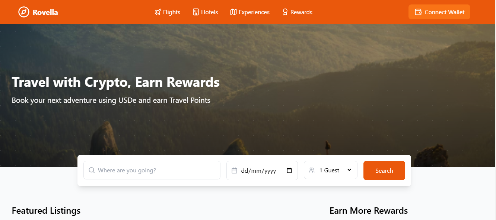

# Rovella - A Decentralized Travel Platform

## Overview

**Rovella** is a decentralized travel platform built on the **Ethena** protocol, allowing users to book flights, hotels, and experiences using **USDe**, a synthetic dollar backed by crypto assets. The platform offers an innovative solution for travelers to access services in a decentralized, crypto-native manner, removing the reliance on traditional banking systems.

With **Rovella**, users can earn **Travel Points** as rewards for every booking made, which are backed by crypto assets and can be used for future bookings or converted into USDe. This platform also introduces a peer-to-peer booking and renting system, allowing users to rent properties or experiences directly with crypto-backed contracts.

### Key Features
- **USDe Payments**: Book flights, hotels, and experiences with **USDe** for a crypto-native payment experience.
- **Travel Points**: Earn **Travel Points** as rewards for bookings, which can be used for future reservations or converted to USDe.
- **Peer-to-Peer Bookings**: Rent properties or book experiences directly with crypto-backed contracts, creating a decentralized marketplace.
- **Staking for Loyalty**: Stake **USDe** to earn loyalty rewards and gain additional benefits.
- **Community Sharing**: Share travel tips and experiences with fellow users, earning crypto rewards in exchange for helpful contributions.

## How It Works

Rovella's ecosystem is powered by the **Ethena protocol**, which supports the **USDe** stablecoin. The protocol leverages a unique mechanism of **delta-hedging** against Ethereum and Bitcoin collateral, maintaining the stability of USDe. This allows for seamless, secure transactions and reward generation across the platform.

1. **Booking**: Users can easily book travel services using **USDe**.
2. **Rewards**: After booking, users earn **Travel Points** which can be redeemed for future travel or converted back to **USDe**.
3. **Staking**: Users can stake their **USDe** to earn loyalty rewards and unlock special benefits such as priority bookings or exclusive deals.
4. **Peer-to-Peer Marketplace**: Users can list their own properties or experiences and allow others to book them through the platform, creating a decentralized travel marketplace.

## The Future of Travel

Rovella is more than just a travel platform—it's an entirely new way to experience the world through the lens of cryptocurrency. By integrating **USDe** and **Ethena**, Rovella aims to bridge the gap between traditional travel and the emerging crypto economy.

The platform provides an opportunity for the global community to engage in a decentralized and permissionless travel experience, powered by the security, transparency, and flexibility of blockchain technology.

---

For more information on how the **Ethena** protocol works and its unique approach to synthetic dollars and the "Internet Bond," please refer to the official [Ethena website](https://ethena.fi/).

## Future Developments

- **Expanded Booking Features**: Adding more travel services such as transportation, tours, and more.
- **Integration with Additional Crypto Assets**: Expanding the types of cryptocurrencies and stablecoins accepted for bookings.
- **Improved Staking Mechanism**: Enhancing the staking process to offer even more rewards and benefits for users.
- **Community Growth**: Building a thriving community of travelers who can contribute to the platform by sharing tips and reviews, earning crypto in return.

---

## Join the Rovella Community

Stay updated and join the conversation with the Rovella community on our social media channels:

- [Telegram](https://t.me/ethena_labs)
- [Discord](https://discord.gg/ethena)
- [Twitter](https://twitter.com/ethena_labs)
- [LinkedIn](https://www.linkedin.com/company/ethena-labs/)

---

## License

This project is licensed under the MIT License - see the [LICENSE](LICENSE) file for details.
